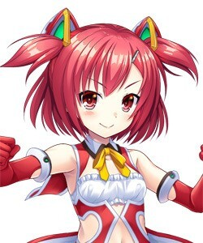
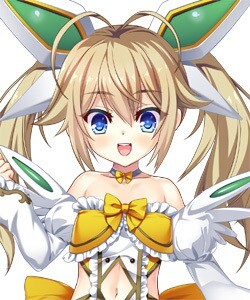
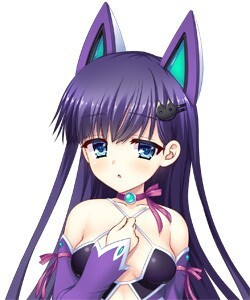
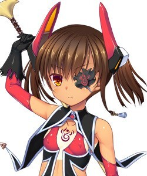
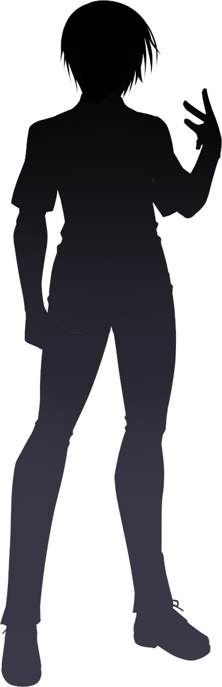
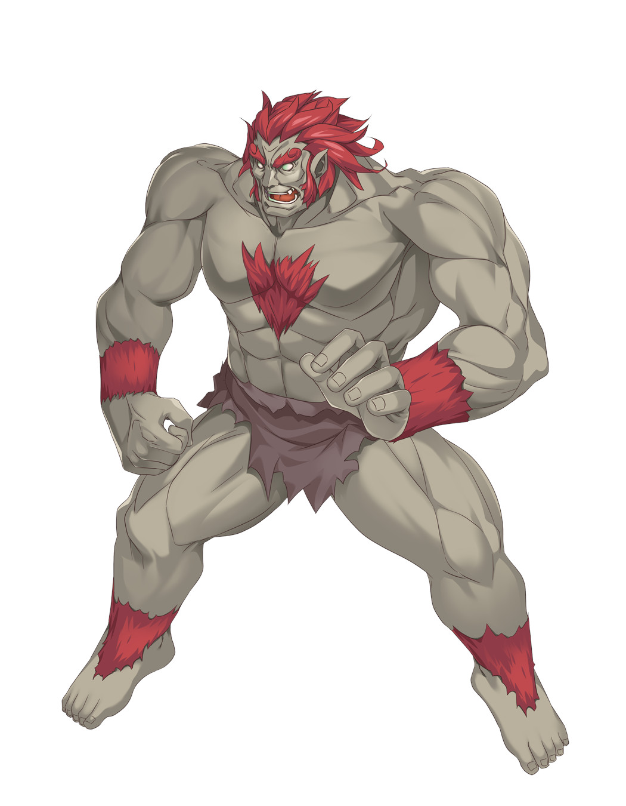
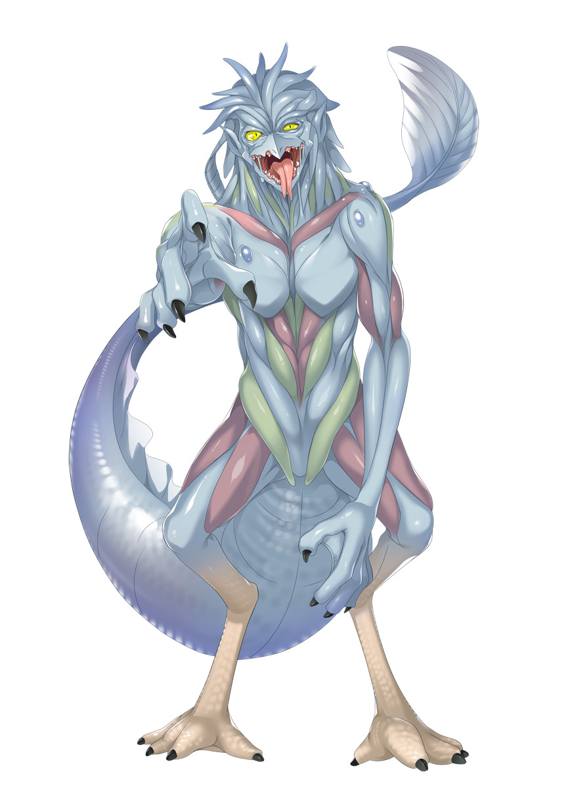
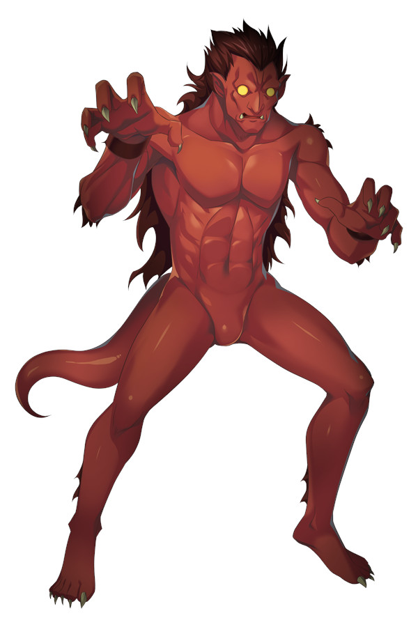
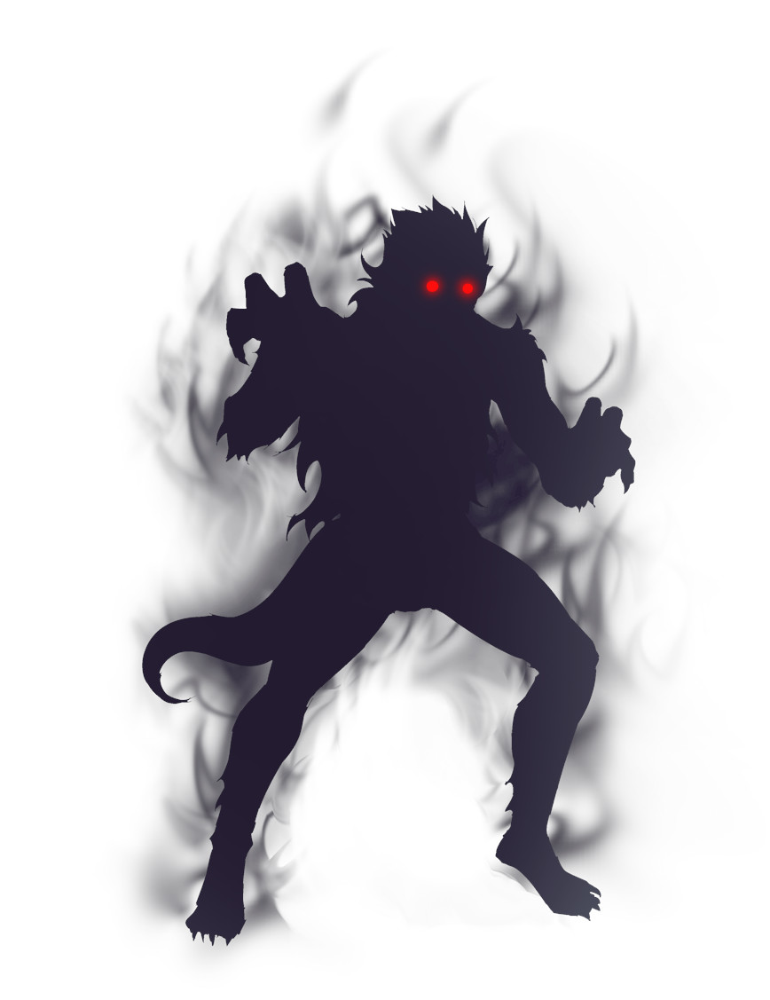
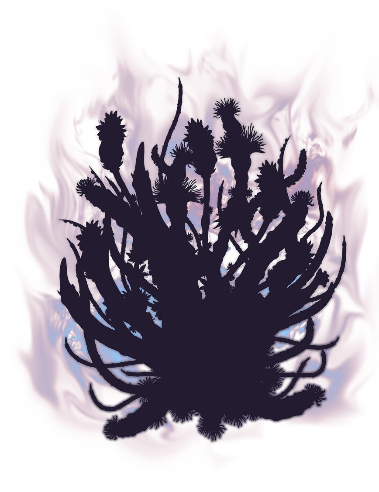

### glossary/character.md

# Character Glossary

This document lists characters referenced in the translated visual novel, including all name variants (nicknames, full names, aliases), their English equivalents, and background synopses to assist with consistent and accurate translation.

---

## Hikami Akane
**TTS Voice Profile**

#### Akane (Internal)
- Model ID: `akane_internal`
- Tone: Softer, introspective, and more emotionally vulnerable. Breathier delivery often accompanied by hesitation or internal conflict.
- Use: Parenthetical lines representing her private thoughts, uncertainty, or quiet yearning.
- Model ID: `akane_clean`
- Vocal Traits: High-pitched, breathy, heroic, emotionally earnest
- Gagged Model: `akane_gagged` (for muffled or restrained delivery)
- Language Tags: `{lang:ja}`, `{lang:en}`
- Emotional Tags: `{emote:cry}`, `{emote:climax}`

- **Variants**: Akane (茜), Hikami Akane, Rouge, ルージュ
- **Translation**: Akane
- **Synopsis**: A brave, cheerful, and optimistic magical girl with a strong sense of honor. Akane wears red and sports red neck-length hair styled into half twin-tails. She has red eyes and often dons hairpins. Her magical girl outfit includes a neck ribbon, turtleneck midriff-baring top, opera gloves, and a pleated skirt — all elements of the traditional magical girl aesthetic.

  A first-year student at St. Étoile Academy, she exemplifies the classic main heroine archetype: always positive, never gives up, and deeply driven by justice. She became close to the protagonist after he saved her life during a critical incident.

  > “I… will never break, no matter what!”

---

## Kashiyama Mia
**TTS Voice Profile**

#### Mia (Internal)
- Model ID: `mia_internal`
- Tone: Smooth, sensual inner tone. Occasionally playful or teasing even when thinking.
- Use: Lines where she reflects on her own pleasure or dominance with elegance.
- Model ID: `mia_clean`
- Vocal Traits: Bubbly, energetic, teasing with a hint of foreign accent
- Gagged Model: `mia_gagged`
- Language Tags: `{lang:ja}`, `{lang:en}`, `{lang:fr}`
- Emotional Tags: `{emote:beg}`, `{emote:cry}`, `{emote:climax}`

- **Variants**: Mia (ミア), Kashiyama Mia, Blanc, ブラン
- **Translation**: Mia
- **Synopsis**: A high-energy, slightly sloppy, and cheerful magical girl of mixed Japanese-American descent. Mia has waist-length blonde hair styled into twin-tails with twin ahoge and blue eyes. Her outfit includes a frilly dress with lace, a bowtie, a choker, detached sleeves, and boots. She also has small head wings and wing-like accessories on her back, completing her bubbly and radiant magical girl image.

  A first-year student at St. Étoile Academy, Mia is half-American, half-Japanese — but her native language is Japanese. While she sometimes plays up her “foreign girl” vibe, she is in fact fully fluent in Japanese and comfortable with traditional magical girl tropes. Since childhood, she’s admired justice-oriented heroines and dreams of being one herself.

  > “When Magical Girl Arcana Blanc gets involved, that kind of trivial predicament is no big deal!”

---

## Hikami Aoi
**TTS Voice Profile**

#### Aoi (Internal)
- Model ID: `aoi_internal`
- Tone: Controlled and reserved, yet perceptibly strained when flustered. Often self-critical or quietly judgmental.
- Use: Reflective analysis or suppressed emotional responses during intense scenes.
- Model ID: `aoi_clean`
- Vocal Traits: Quiet, emotionally fragile, soft-spoken
- Gagged Model: `aoi_gagged`
- Language Tags: `{lang:ja}`, `{lang:en}`
- Emotional Tags: `{emote:cry}`, `{emote:climax}`, `{emote:apologetic}`

- **Variants**: Aoi (葵), Hikami Aoi, Violet, ヴィオレ
- **Translation**: Aoi
- **Synopsis**: A quiet, emotionally sensitive magical girl with a strong pacifist streak. Aoi has hip-length violet hair with blunt bangs, often adorned with hairclips, and striking blue eyes. Her magical girl costume includes a neck ribbon, detached sleeves, a brooch, and a dress that reveals her midriff. She wears a nekomimi headband, a tail accessory, anklets, and Mary Jane shoes — mixing cuteness with a melancholic aura.

  A top student in Akane’s class at St. Étoile Academy, Aoi possesses great magical power but fears hurting others. She is reluctant to fight, often burdened by guilt and self-blame. Her deep emotional scars make her especially vulnerable to manipulation and mental torment.

  > “This must be the punishment I have to bear… because I did something wrong…”

---

## Shidou Mei
**TTS Voice Profile**

#### Mei (Internal)
- Model ID: `mei_internal`
- Tone: Innocent and hesitant, often with a whispery quality. Shows nervousness or wonder in unfamiliar situations.
- Use: Curious or confused internal reactions, often with emotional transparency.
- Model ID: `mei_clean`
- Vocal Traits: Cool, detached, slightly sultry with confident undertone
- Gagged Model: `mei_gagged`
- Language Tags: `{lang:ja}`, `{lang:en}`
- Emotional Tags: `{emote:climax}`, `{emote:taunt}`, `{emote:command}`

- **Variants**: Mei (冥), Shidou Mei, Arcana Noire, ノワール
- **Translation**: Mei
- **Synopsis**: A mysterious demon girl with tan skin, amber eyes, and brown hair styled into twin-tails with antennae. Mei wears an eyepatch over her right eye and has a visible tattoo, enhancing her exotic mystique. Her costume includes a midriff-baring dress, detached sleeves, asymmetrical and striped stockings, a capelet, and a signature scythe — merging gothic and magical girl themes.

  She introduces herself as “Demon Magical Girl Noire.” Though originally destined to awaken as a regular magical girl, something caused her to diverge from that path. Her transformed state emphasizes bare skin and corrupted body parts, symbolizing her alienation from the other heroines both visually and narratively.

  > “My name is Shidou Mei… and I am the Demon Magical Girl Noire!”

---

## Protagonist / Teacher

- **Variants**: Main Character, Protagonist, Teacher
- **Translation**: N/A (Player character)
- **Synopsis**: A 30-year-old male teacher at St. Étoile Academy. He becomes embroiled in the magical conflict after discovering his students are secretly magical girls. Initially caught off guard, he grows into a crucial support figure, especially in dark and sexually charged circumstances.

  While unnamed and often presented as a silhouette in-game, he serves as the narrative's perspective and moral fulcrum. In scenes involving corruption, he is frequently portrayed as the last human anchor in an increasingly alien world — a theme central to the tone of "white turbidity equivalent" scenarios, where his role alternates between protector, observer, and inevitable participant.

  _Note: His internal monologue and reactions shape the emotional pacing of intimate scenes._

---

## Kaku'en (カクエン)

- **Variants**: カクエン (Kaku'en)
- **Translation**: Kaku'en (tentative; based on phonetic reading)
- **Synopsis**: A towering demonic antagonist inspired by mythical monkey kings from Chinese folklore. Kaku'en dwarfs the magical girls in both size and ferocity — a fact clearly visualized in combat scenes and emphasized during violent, erotic confrontations, particularly with Akane. His design features exaggerated musculature, fanged expressions, and wild red fur-like growths around his limbs and chest.

  He is sadistic by nature, reveling in destruction and domination. His speech is brutish and guttural, emphasizing his primal and animalistic traits. The girls, all approximately 140 cm tall, are physically overwhelmed by his monstrous stature. His role represents a living embodiment of the corrupting force the magical girls must face.

  > “Nuaaaaaugh!?”

---

## Mizuchi (ミズチ)

- **Variants**: ミズチ (Mizuchi)
- **Translation**: Mizuchi (tentative; based on Japanese serpent-dragon folklore)
- **Synopsis**: A serpentine demon partner of Kaku'en, Mizuchi is a key antagonist known for using tentacles in erotic and combative scenarios. His slick, alien physique includes multiple limbs and a massive tail, suggesting a semi-aquatic origin. His sadism is subtler than Kaku'en’s, but no less cruel.

  In early scenes, Mizuchi’s motivation is explicitly to take the virginity of the magical girls, believing it grants power to both him and Kaku'en. He relishes psychological domination as much as physical, often acting with a smug, predatory intelligence. His name and aquatic design may be drawn from the mythical Japanese water dragon or serpent, also called "mizuchi," known for ensnaring and devouring maidens.

  _Note: Scenes involving Mizuchi frequently feature restraint, entrapment, and biological invasion as thematic motifs._

---

## Shoujou (ショウジョウ)

- **Variants**: ショウジョウ (Shoujou)
- **Translation**: Shoujou (tentative; may reference the mythological red-faced sake-loving ape-like spirit)
- **Synopsis**: A minor demon antagonist with red skin, glowing eyes, and bestial features. Shoujou is ultimately defeated by Aoi prior to the events of the main story. His death is cited by Kaku'en and Mizuchi as one of the justifications for their campaign of vengeance against the magical girls.

  Although he plays a smaller role in the overall narrative, his violent end is referenced often, especially in scenes that highlight Aoi’s hidden power or the dark consequences of conflict. His aesthetic evokes rage and primal instinct, with exaggerated claws and an aggressive posture.

  _Note: The name may draw influence from the mythical creature Shōjō, though the personality and role in this story diverge significantly._

---

## Lesser Demon Type A (下級Ａ)

- **Variants**: 下級Ａ, 下級冥魔１, 下級冥魔２, etc.
- **Translation**: Lesser Demon Type A
- **Synopsis**: A class of common, low-tier demons encountered frequently in group battles. These demons exhibit humanoid silhouettes cloaked in black flame or shadow, with glowing red eyes. Their individuality is minimal, and they serve primarily as cannon fodder or introductory threats during story events.

  While they lack unique identities, their presence is a constant symbol of the invading force's spread and the magical girls' need to fight even the most basic threats in emotionally and physically taxing ways.

---

## Lesser Demon Type B (下級Ｂ)

- **Variants**: 下級Ｂ, 下級冥魔１, 下級冥魔２, etc.
- **Translation**: Lesser Demon Type B
- **Synopsis**: Another form of low-level demonic entity, distinguished from Type A by a more alien, floral, or tentacular mass-like body. Type B demons are commonly associated with swarming behaviors, sensory appendages, and unpredictable movement.

  Often encountered in more surreal or corrupted environments, they pose a more psychological threat than Type A, overwhelming targets through confusion, entrapment, and grotesque distortion rather than brute force.

  _Note: These creatures may vary slightly in appearance depending on scene context, but are consistently non-individualized._

---

- Model ID: `akane_internal`
- Tone: Softer, introspective, and more emotionally vulnerable. Breathier delivery often accompanied by hesitation or internal conflict.
- Use: Parenthetical lines representing her private thoughts, uncertainty, or quiet yearning.
- Model ID: `aoi_internal`
- Tone: Controlled and reserved, yet perceptibly strained when flustered. Often self-critical or quietly judgmental.
- Use: Reflective analysis or suppressed emotional responses during intense scenes.
- Model ID: `mia_internal`
- Tone: Smooth, sensual inner tone. Occasionally playful or teasing even when thinking.
- Use: Lines where she reflects on her own pleasure or dominance with elegance.
- Model ID: `mei_internal`
- Tone: Innocent and hesitant, often with a whispery quality. Shows nervousness or wonder in unfamiliar situations.
- Use: Curious or confused internal reactions, often with emotional transparency.